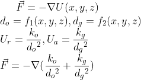
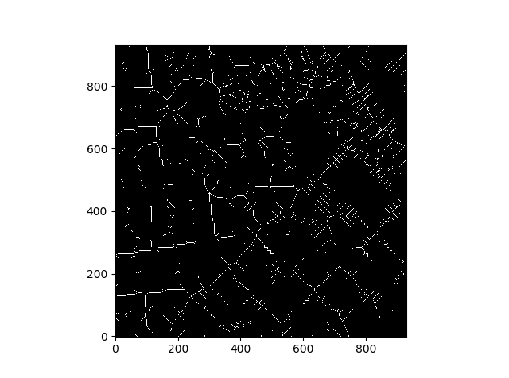
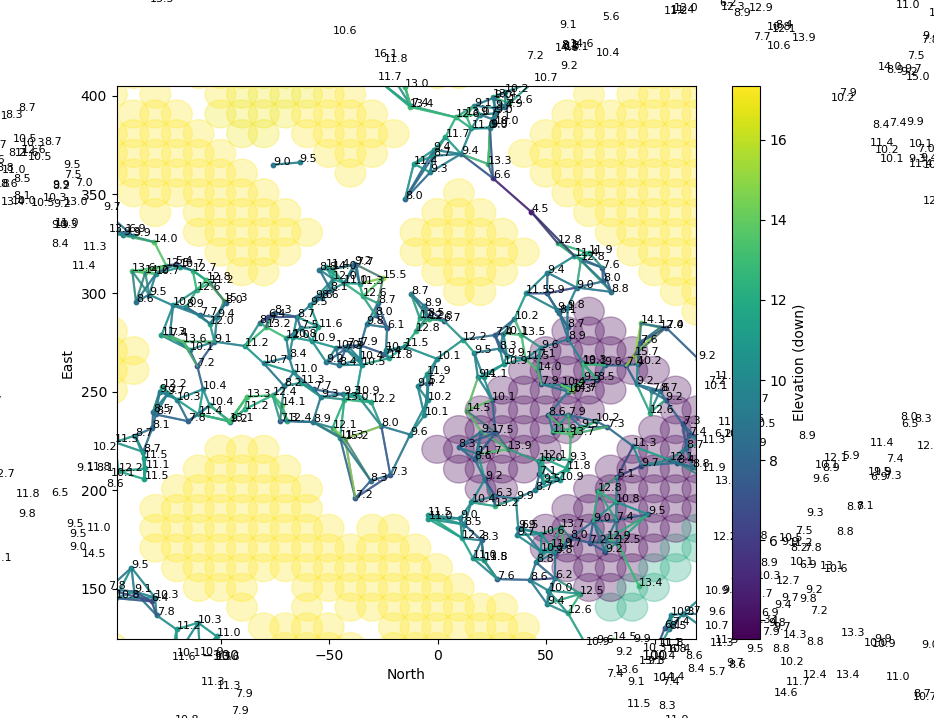

# Ronen Aniti. Path Planning Project.
Tagline. Ronen Aniti. 
Photo. Title. Tagline: Hire me for _____.

# Who am I, and what is this page about?

## Who am I
I am a student interseted in becoming a gnc engineer. Evidence 1. Evidence 2. 
Optional. A Video presentation explaining who I am and what this project is about, with Live Simulator Footage, under 5 Minutes. 

## What is this page about?
1. Provide evidence of my skills and abilities qualifying me for the position of _________. 2. Document the project __________, which is the second project that I document, the first of which is ______, and the projects
I will be working on in the future are ____, ____, and _____. 

# The motion planning project: an overview

## What is this project really about? 
This project is really about this. Fact 1. Fact 2. Fact 3.

## Why does this project matter to me? 
The project matters for several reasons. Reason 1. Reason 2. 

## What concepts did I learn about, and what skills did I gain in the process?
Concept or skill 1. Concept or skill 2. Concept or skill 3. 

# Project Details

## What features did I implement?
Answer. 
1. Global path planning. Summary of what that means. 
2. Receding horizon path planning. Summary of what that means. 
3. Replanning. Summary of that means. 

## How do those features work?
Answer.

### The global path planners
The global planners are these, and they work like this.
1. RRT. How it works, generally. How I implemented it in code. Graph of trajectory. 
2. PRM. How it works, generally. How I implemented it in code. Graph of trajectory. 
3. Potential field. How it works, generally, including the governing equation. How I implemented it in code. Graph of trajectory. 

4. 2d Grid. How it works, generally. How I implemented it in code. Graph of trajectory. 
5. Voxel map. How it works generally. How I implemented it in code. Graph of trajectory. 
6. Voronoi graph. How it works, generally. How I implemented it in code. Graph of trajectory. 
7. Medial axis map. How it works, generally. How I implemented it in code. Graph of trajectory.
8. 2d graph. How it works, generally. How I implemented it in code. Graph or trajectory. 

### The local path planner
The receding horizon planner definition. How it works, generally. How I implemented it in code. Graph of trajectory. 

### Replanning
The definition of replanning. How it works, generally. How I implemented it in code. Graph of trajectory. 

## What challenges did I face, and how did I solve them? 
1. Challenge 1. Solution 1. 
2. Challenge 2. Solution 2.
3. Challenge 3. Solution 3. 

## Some Test Results
Plot 2 bar graphs. The first one will show the average runtime, n=1000, for each global planner. The second will show the average cost, n=1000, for each planner. Make a brief statement about how I used
this information to set the default planner. But also make a statement about the relative pros and cons about each planner. 

## Where would I go with this project if I had more time? 
1. Learn more Numpy, Matplotlib
2. Learn more about data structures and algorithms
3. Dive deeper into multivariable calculus. 
4. Begin learning about control systems. 

## How could I test out this code on my own computer? 
1. Install. Simulator. FCND environment with packages like this, this, and this.  
2. Run. On terminal, python main.py.
3. Modify parameters. Test out different geodetic destinations. Or add different geodetic destinations to a list of destinations. 

# Contact me
## How could you learn more about me? 
1. Email or text me. 
2. Touch base. 
3. Schedule a call. 
4. Interview me for a job. 
5. Figure out if we could work together. 

# Links to other projects
These are links to the other projects in that comprise my portfolio.
1. Tutoring
2. Path planning
3. Control systems
4. State estimation
5. Fixed-wing control